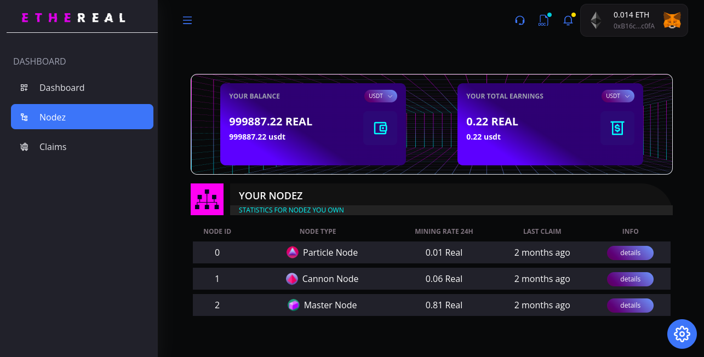

# EtherNode Dapp

The EtherNode Dapp is a decentralized application that provides users with a user-friendly interface to interact with the EtherNode ecosystem. The application seamlessly integrates with two main components: the smart contract backend and the frontend interface.

## Smart Contract

The smart contract serves as the backbone of the EtherNode Dapp, implementing crucial functionalities such as node purchasing, ownership transfers, staking rewards claiming, and node deactivation. Users can deploy the EtherNode smart contract by following the instructions outlined in the `contract/readme.md` file. This ensures the proper initialization and configuration of the contract on the Ethereum blockchain.

## Frontend Interface

The frontend interface is designed to facilitate user interactions with the EtherNode smart contract. It allows users to easily perform actions like purchasing nodes, viewing owned nodes, claiming staking rewards, transferring ownership of nodes, and deactivating nodes. The frontend is built using the ThirdWeb SDK for smart contract interactions, the Ethers library for web3 computations, and Tailwind CSS for component styling.

## Local Deployment Steps

To deploy the EtherNode Dapp locally, follow these steps:

### 1. Deploy the Smart Contract

Refer to the `contract/readme.md` file for detailed instructions on deploying the EtherNode smart contract. Ensure that you follow the provided steps to successfully set up the contract on the Ethereum blockchain.

### 2. Update Frontend Variables

1. Change your directory to the `frontend` folder.

   ```bash
   cd frontend
   ```

2. Install dependencies using yarn.

   ```bash
   yarn install
   ```

3. Copy the `src/constants/sample.constants.js` file and paste it as `index.js`.

4. Update the values in `index.js` for the following constants with your specific values:
   - `THIRDWEB_CLIENT_ID`: Your ThirdWeb SDK client ID.
   - `REAL_TOKEN_CONTRACT_ADDRESS`: The address of the real token contract.
   - `ETHERNODE_CONTRACT_ADDRESS`: The address of the EtherNode smart contract.

### 3. Deploy the Frontend

Start the EtherNode Dapp Frontend by running the following command:

```bash
yarn start
```

Visit [http://localhost:3000](http://localhost:3000) in your web browser to access the EtherNode Dapp locally.

### OR
Visit [https://ether-node-dapp-8a4a71.netlify.app/](https://ether-node-dapp-8a4a71.netlify.app/) for demo version on testnet

By following these steps, you'll have the EtherNode Dapp running on your local server, allowing you to explore and interact with the decentralized features provided by the EtherNode ecosystem. Happy exploring! 🌐🚀
